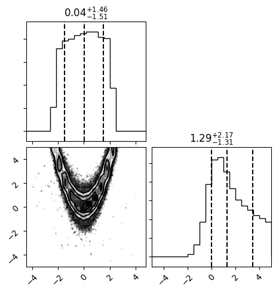

***approxposterior***

Overview
========

A common task in science or data analysis is to perform Bayesian inference to derive a posterior probability distribution
for model parameters conditioned on some observed data with uncertainties.  In astronomy, for example, it is common
to fit for the stellar and planetary radii from observations of stellar fluxes as a function of time using the Mandel & Agol (2002)
transit model.  Typically, one can derive posterior distributions for model parameters using Markov Chain Monte Carlo (MCMC) techniques where each MCMC iteration, one computes the likelihood of the data given the model parameters.  One must run the forward model to make predictions to be compared against the observations and their uncertainties to compute the likelihood.  MCMC chains can require anywhere from 10,000 to over 1,000,000 likelihood evaluations, depending on the complexity of the model and the dimensionality of the problem.  When one uses a slow forward model, one that takes minutes to run, running an MCMC analysis quickly becomes very computationally expensive.  In this case, approximate techniques are requires to compute Bayesian posterior distributions in a reasonable amount of time by minimizing the number
of forward model evaluations.

This package is a Python implementation of [Bayesian Active Learning for Posterior Estimation](https://www.cs.cmu.edu/~kkandasa/pubs/kandasamyIJCAI15activePostEst.pdf) by Kandasamy et al. (2015) and [Adaptive Gaussian process approximation for Bayesian inference with expensive likelihood functions](https://arxiv.org/abs/1703.09930) by Wang & Li (2017).
These algorithms allows the user to compute approximate posterior probability distributions using computationally expensive forward models by training a Gaussian Process (GP) surrogate for the likelihood evaluation.  The algorithms leverage the inherent uncertainty in the GP's predictions to identify high-likelihood regions in parameter space where the GP is uncertain.  The algorithms then run the forward model at these points to compute their likelihood and re-trains the GP to maximize the GP's predictive ability while minimizing the number of forward model evaluations.  Check out [Bayesian Active Learning for Posterior Estimation](https://www.cs.cmu.edu/~kkandasa/pubs/kandasamyIJCAI15activePostEst.pdf) by Kandasamy et al. (2015) and [Adaptive Gaussian process approximation for Bayesian inference with expensive likelihood functions](https://arxiv.org/abs/1703.09930) by Wang & Li (2017)
for in-depth descriptions of the respective algorithms.

approxposterior runs on both Python 2.7+ and 3.6.

[](https://travis-ci.org/dflemin3/approxposterior)

[](https://doi.org/10.21105/joss.00781)

Check out the [documentation](https://dflemin3.github.io/approxposterior/) for a more in-depth explanation about the code!

Installation
============

The preferred method for installing approxposterior and all dependencies is using conda via the following:

```bash
conda install -c conda-forge approxposterior
```

One can also use pip to install approxposterior via

```bash
pip install approxposterior
```

This step can fail if george (the Python Gaussian Process package) is not properly installed and compiled.
To install george, run

```bash
    conda install -c conda-forge george
```

After installing george, one can then pip install approxposterior or clone the repository and run

```bash
python setup.py install
```

A simple example
===================

Below is a simple application of approxposterior based on the Wang & Li (2017) example. Note that
we adapted this example and shortened it so that it only takes about 1 minute to run.

To keep track of the MCMC progress, set ```verbose = True``` in the ```ap.run``` method. This setting
outputs X/M where M is the total number of MCMC iterations to be evaluated, 5,000 in this example, and x is the current
iteration number.  Note that setting ```verbose = True``` also outputs additional diagnostic information, such as when
the MCMC finishes, what the estimated burn-in is, and other quantities that are useful for tracking the progress of
your code.  In this example, we set ```verbose = False``` for simplicity.

```python
# Define algorithm parameters
m0 = 200                          # Initial size of training set
m = 20                            # Number of new points to find each iteration
nmax = 2                          # Maximum number of iterations
M = int(5.0e3)                    # Number of MCMC steps to estimate approximate posterior
Dmax = 0.1                        # KL-Divergence convergence limit
kmax = 5                          # Number of iterations for Dmax convergence to kick in
which_kernel = "ExpSquaredKernel" # Which Gaussian Process kernel to use
bounds = ((-5,5), (-5,5))         # Prior bounds
algorithm = "bape"                # Use the Kandasamy et al. (2015) formalism

# Initialize object using the Wang & Li (2017) Rosenbrock function example
ap = bp.ApproxPosterior(lnprior=lh.rosenbrock_lnprior,
                        lnlike=lh.rosenbrock_lnlike,
                        prior_sample=lh.rosenbrock_sample,
                        algorithm=algorithm)

# Run!
ap.run(m0=m0, m=m, M=M, nmax=nmax, Dmax=Dmax, kmax=kmax,
        sampler=None, bounds=bounds, which_kernel=which_kernel,
        n_kl_samples=100000, verbose=False)

# Check out the final posterior distribution!
import corner

fig = corner.corner(ap.samplers[-1].flatchain[ap.iburns[-1]:],
                            quantiles=[0.16, 0.5, 0.84], show_titles=True,
                            scale_hist=True, plot_contours=True)

#fig.savefig("final_posterior.png", bbox_inches="tight") # Uncomment to save
```

The final distribution will look something like this:



Check out the [examples](https://github.com/dflemin3/approxposterior/tree/master/examples/Notebooks) directory for Jupyter Notebook examples for detailed examples and explanations and check out the full [documentation](https://dflemin3.github.io/approxposterior/) for a more in-depth explanation of classes, methods, variables, and how to use the code.

Contribution
============

If you would like to contribute to this code, please feel free to fork the repository and open a pull request.
If you find a bug, have a suggestion, etc, please open up an issue!

Please cite this repository and both Kandasamy et al. (2015) and Wang & Li (2017) if you use this code!
